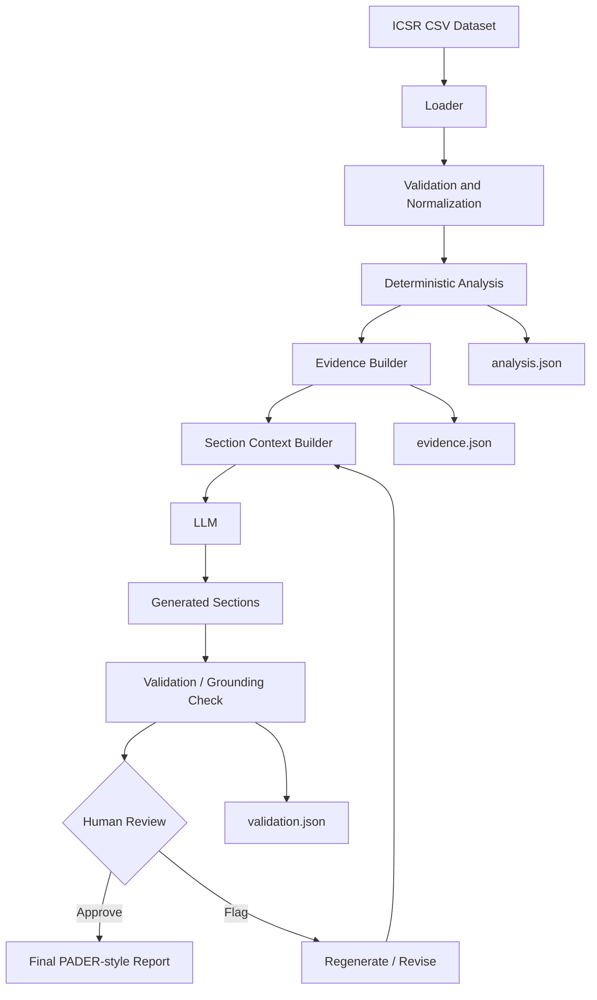

# Architecture

## Core design decision

Python owns arithmetic and data aggregation. The LLM receives only scoped,
approved evidence for the section it is writing.

The raw CSV is never sent directly to the LLM.
